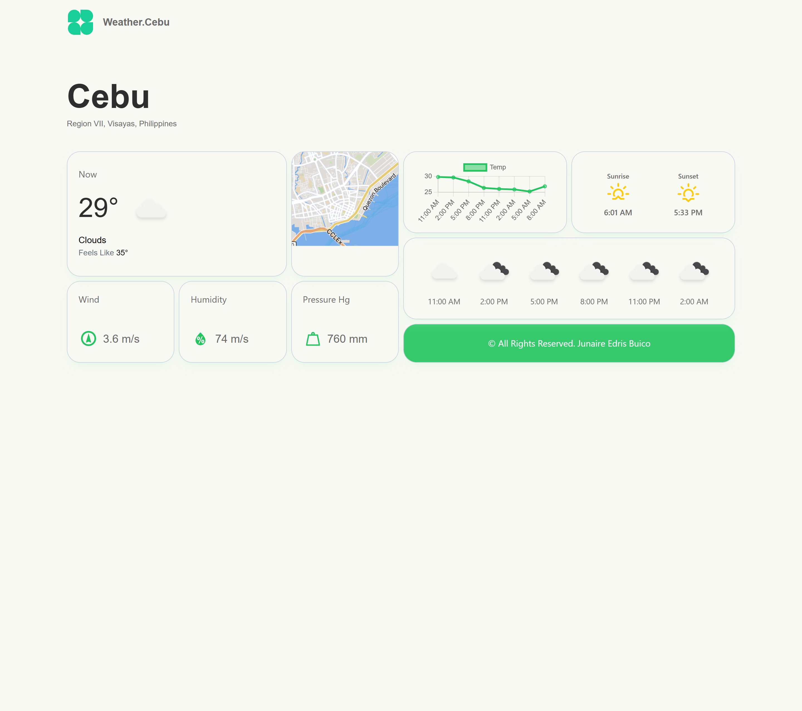

# Weather App using OpenWeatherMap API

This project was bootstrapped with [Create React App](https://github.com/facebook/create-react-app) typescript.

[](https://weather-app-jun-edris.vercel.app/)

## Tech Stack

- **Framework:** [React.js](https://reactjs.org)
- **Styling:** [Tailwind CSS](https://tailwindcss.com)
- **WeatherAPI:** [OpenWeather](https://openweathermap.org/)
- **Fetching Query:** [React Query](https://tanstack.com/query/v4/docs/react/adapters/react-query)

## Running Locally

1. Clone the repository

   ```
   git clone https://github.com/sadmann7/weather-app.git
   ```

2. Install dependencies using pnpm

   ```
   yarn install
   ```

3. Create an `.env` file and paste your token from Open Weather.
4. Start the development server

   ```
   yarn start
   ```

## Learn More

You can learn more in the [Create React App documentation](https://facebook.github.io/create-react-app/docs/getting-started).

To learn React, check out the [React documentation](https://reactjs.org/).

## License

Licensed under the MIT License. Check the [LICENSE](./LICENSE.md) file for details.
